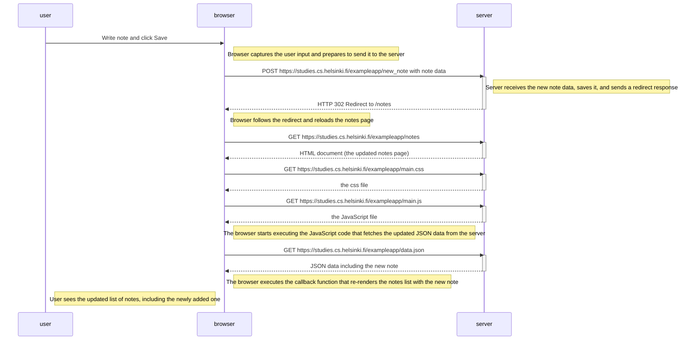

```mermaid
sequenceDiagram
    participant user
    participant browser
    participant server

    user->>browser: Write note and click Save
    Note right of browser: Browser captures the user input and prepares to send it to the server

    browser->>server: POST https://studies.cs.helsinki.fi/exampleapp/new_note with note data
    activate server
    Note right of server: Server receives the new note data, saves it, and sends a redirect response
    server-->>browser: HTTP 302 Redirect to /notes
    deactivate server

    Note right of browser: Browser follows the redirect and reloads the notes page

    browser->>server: GET https://studies.cs.helsinki.fi/exampleapp/notes
    activate server
    server-->>browser: HTML document (the updated notes page)
    deactivate server

    browser->>server: GET https://studies.cs.helsinki.fi/exampleapp/main.css
    activate server
    server-->>browser: the css file
    deactivate server

    browser->>server: GET https://studies.cs.helsinki.fi/exampleapp/main.js
    activate server
    server-->>browser: the JavaScript file
    deactivate server

    Note right of browser: The browser starts executing the JavaScript code that fetches the updated JSON data from the server

    browser->>server: GET https://studies.cs.helsinki.fi/exampleapp/data.json
    activate server
    server-->>browser: JSON data including the new note
    deactivate server

    Note right of browser: The browser executes the callback function that re-renders the notes list with the new note
    Note right of user: User sees the updated list of notes, including the newly added one
```
