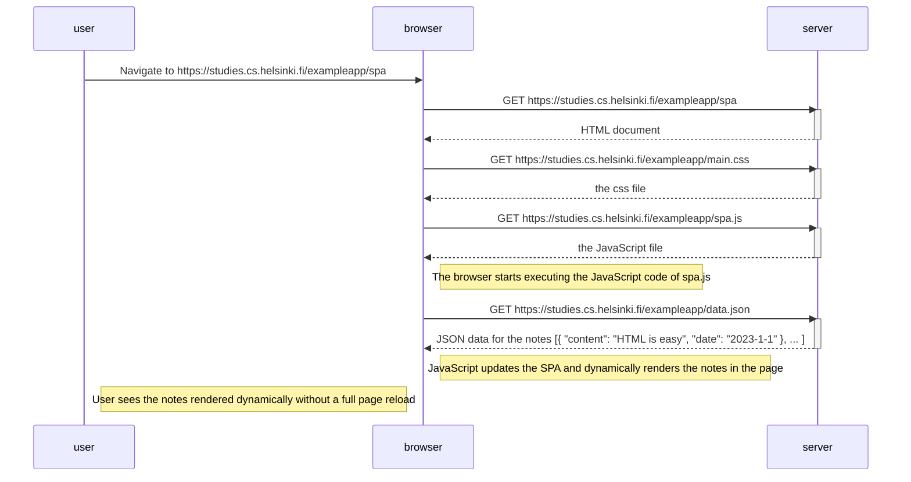

```mermaid
sequenceDiagram
    participant user
    participant browser
    participant server

    user->>browser: Navigate to https://studies.cs.helsinki.fi/exampleapp/spa
    browser->>server: GET https://studies.cs.helsinki.fi/exampleapp/spa
    activate server
    server-->>browser: HTML document
    deactivate server

    browser->>server: GET https://studies.cs.helsinki.fi/exampleapp/main.css
    activate server
    server-->>browser: the css file
    deactivate server

    browser->>server: GET https://studies.cs.helsinki.fi/exampleapp/spa.js
    activate server
    server-->>browser: the JavaScript file
    deactivate server

    Note right of browser: The browser starts executing the JavaScript code of spa.js

    browser->>server: GET https://studies.cs.helsinki.fi/exampleapp/data.json
    activate server
    server-->>browser: JSON data for the notes [{ "content": "HTML is easy", "date": "2023-1-1" }, ... ]
    deactivate server

    Note right of browser: JavaScript updates the SPA and dynamically renders the notes in the page
    Note right of user: User sees the notes rendered dynamically without a full page reload

```
